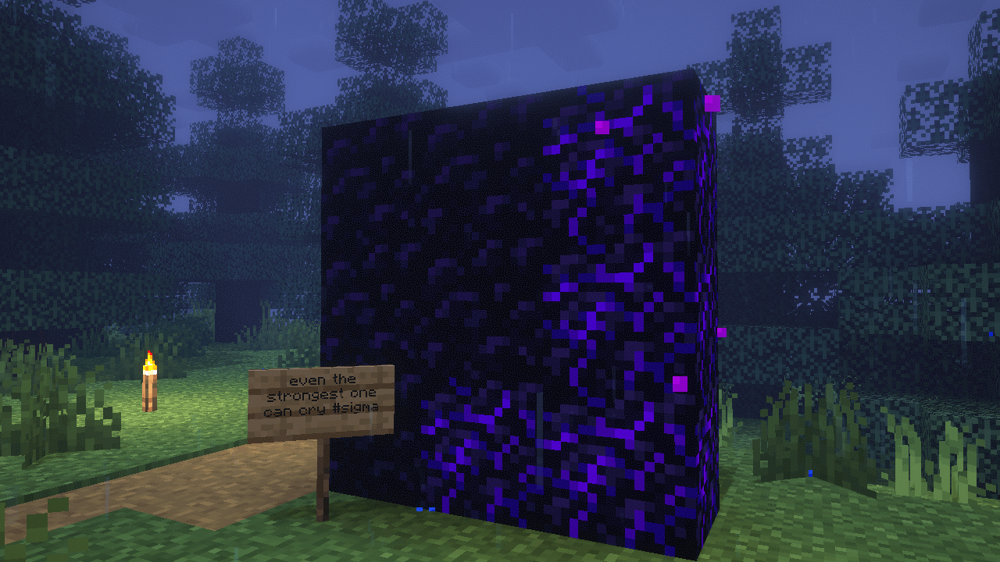

<h1 align="center">Hi 👋, Treexle Here!</h1>

<h3 align="center">Game Developer and Front-end Web Developer</h3>

  

### 💫 About Me:

- 🔭 I’m currently working on Random Project during my free time
- 🌱 I’m currently learning Godot Engine
- 📫 How to reach me **treexle3@gmail.com**
- 🏫 High School Student
- ⚡ Fun fact **Normal People**

<h3 align="left">Connect with me:</h3>

  
  

<h3 align="left">Languages and Tools:</h3>

  
  
  
  
  
  
  
  
  
  
  
  
  
  
  

### 📊 GitHub Stats:

 
 

### 🏆 GitHub Trophies

###
